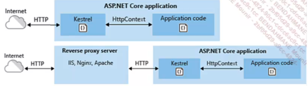

# .NET

.NET est un framework de developpement cross plateforme et open source concus par microsoft.

Voici un appercu des technologie .NET 


La premiere différence entre .NET et .NET core est que .NET core est open source et cross plateform, tandis que .NET Framework est propriétaire et ne fonctionne que sur windows.

La portabilité de .NET core est possible car il depend pas de windows, mais de CoreCLR, une version de CLR (Commun Language Runtine)

Les librairies NuGets : .NET core utilise les librairies NuGet, qui sont des librairies open-source, tandis que .NET Framework ne sont pas encore portees sur .NET Core. 

## .NET Core 

L'une des premiere technologie introduite par .NET CORE est ASP .NET Core, qui est un framework open-source et cross plateform, qui permet de : 

- d'unifier les API UI et Web API
- d'intégrer les framework client side comme Angular, react, vue
- de s'integrer facilement dans un environnement cloud 
- d'héberger des applcations avec Docker Apache Ngix

## Le pattern MVC 

.NET utilise le pattern MVC (model vue controller) pour developper des app web : 

- Separation des couches logiques, metier et présentation
- Razor pages permet de creer des pages web
- du model Binding et de la validation de model


Voici l'architechture d'un projet .NET console (cf projet), pour en créer une il suffit de taper la commade suivante : 

```bash
dotnet new console
```

 On remarque que le contenu du code source est alors constituée d'une seul ligne dans le fichier Program.cs*


 ```csharp
 Console.WriteLine("Hello, World!");
 ```

 Si on veut obtenir un programme avec l'ancienne syntaxe, il suffit de taper la commande suivante : 

 ```bash
dotnet new console --use-program-main
```

Pour lancer le programme 

```bash
dotnet run
```

Pour faire un projet MVC, il suffit de faire la commande : 

```bash
dotnet new mvc
```

Le serveur web fournir avec ASP .NET core est Kestrel, qui est un serveur Web cross-platform.



Kestrel va traiter toutes les requetes et fournira les réponses au travers d'un objet de type `HttpContext`.

## La convergence des frameworks .NET avec la version 5.0


## Les composants de .NET core 

1. Les librairies CoreFX

Ces librairies integrent toutes les classes de bases de .NET Core et disponibles sous l'espace de nom `System.*` (namespace) 

La grande majorite des API de core FX sont aussi disponibles sur .NET Frameworks classique. 
L'équivalent de CoreFX sur .NET Framework est le .NET Framework Class Library (FCL/BCL). CoreFX est en quelque sorte un **fork** de FCL/BCL.

## Le langage C#

C# est un langage de programmation oriente objet, qui est tres proche du Java. 

## Version 7.0

Qu'est-ce qu'un tuple ?? 

```csharp
// tuple en csharp
var lettres = ("a", "b");

//
(String Alpha, String Beta) letters = ("a", "b");
var alphabet = (Alpha: "a", Beta: "b");
alphabet.Alpha; // a
alphabet.Beta // b 
```

```cs
    private static (int Max, int Min) Range (IEnumerable<int> numbers) 
    {
        int min = numbers[0];
        int max = numbers[0];
        foreach (var n in numbers[1..])
        {
        min = n < min ? n : min;
        max = n < max ? n : max;
        }
        return (max, min);
    }
```


```cs
    public static int Sum(IEnumerable<int> values)
    {
        var sum = 0;
        foreach (var item in values)
        {
            switch (item)
            {
                case 0;
                break;
                case int val;
                sum += val;
                break;
                case IEnumerable<object> subList when subList.Any();
                sum += Sum(subList)
            }
        }
    }

```

### Version 7.1

```cs
int count 5;
string label = "Colors used in the map"

var pair = (count, label);
pair.count // 5
```

On peut maintenant utiliser le mot `async` dans les noms de methodes main, par exemples : 

```cs
public static async Task Mains()
{
    await DoSomethingAsync();
}
```

## Version 7.2

Nouveautés : 

- le mot clé `in` pour les paramètres de méthode: la variable est passé par référence, mais ne peut pas être modifiée 

- le mot clé `ref readonly` pour les paramètres de methode: la variable est passée par référence, maus ne peut pas être modifiée

- le mot clé `readonly struct` : la structure est immutable et ne peut pas être transferee qu'avec le mot clé `in`

## Version 8.0 

```cs
String? s = null;
// le ? sert a enlever le warning pour que le compliateur comprenne que sa peut potentiellement etre nul
Console.WriteLine(s);
```

En C#, il est possible de fournir une implementation par defaut pour les interfaces, par exemple : 

cf projet exemple

en C#, il est possible de declarer assez facilement une séquence de valeurs, par exmeple : 

```cs
// range
var  maRange = array[4..^2]
```

## Les fonctionnalites de .NET Core

### Le cli

les commandes utiles : 
- dotnet new : nouveaux projet
- dotnet restore : restaure les packages 
- dotnet build : compile le projet
- dotnet run : execute le projet
- dotnet test : execute les test unitaires 
- dotnet publish : publie le projet 
- dotnet pack : cree un package NuGet

### La structure d'une solution .NET

Une solution .NET est un conteneur pour un ou plusieurs projets .NET. Elle est representee par un fichier avec l'extension `.sln`.

### - Properties :
 
 - integre les propriété du projet mais pas tous

 launchSettings.json


 ### - wwwroot

 - contien du css js 

 tous les fichier destiner au client en prod

### - Controllers / Models / Views 

- Contient le code sources 

### - Appsetting.json

- Fichier de parametrage spécifique de l'environnement données 

- les url vers la bdd se mettent ici 

### Programe.cs

Point d'acces de l'app (comme le app.js avec React)


### La configuration de l'application 

Les fichiers de configuration 